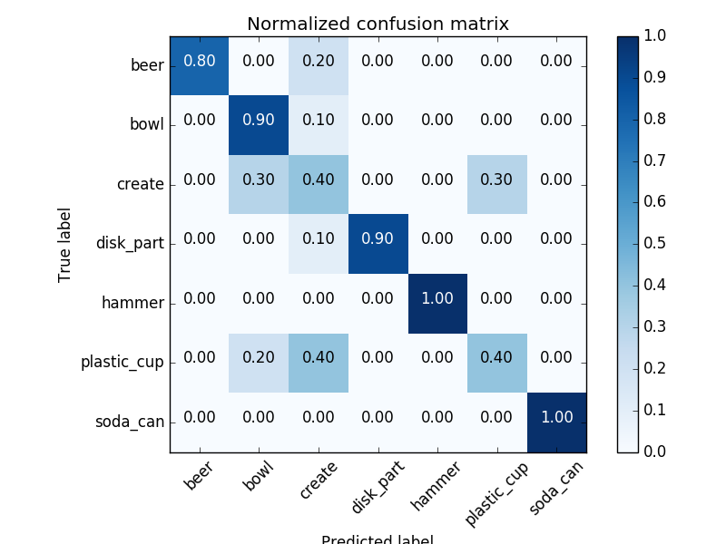
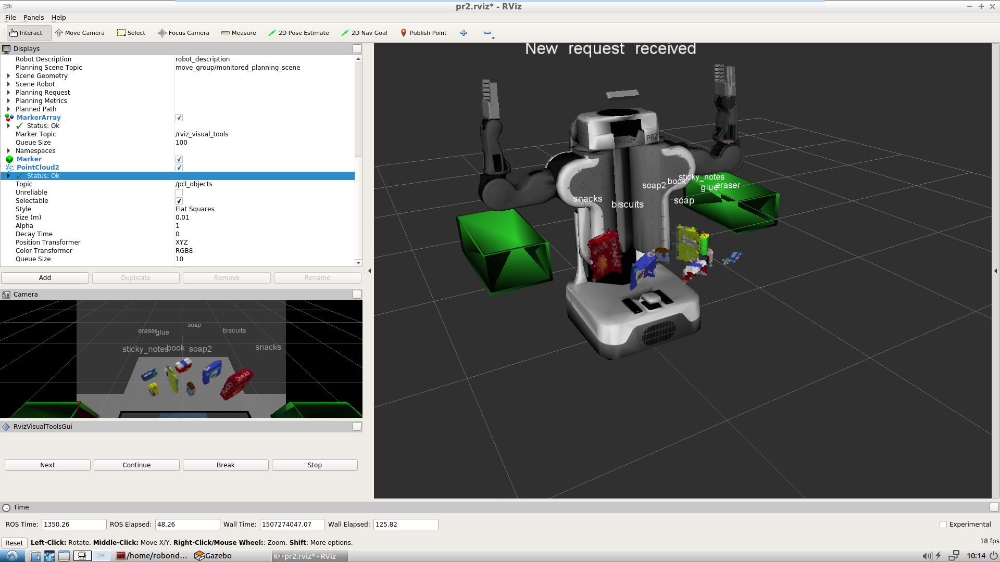

## Project: Perception Pick & Place
### Writeup Template: You can use this file as a template for your writeup if you want to submit it as a markdown file, but feel free to use some other method and submit a pdf if you prefer.

---

# Required Steps for a Passing Submission:
1. Extract features and train an SVM model on new objects (see `pick_list_*.yaml` in `/pr2_robot/config/` for the list of models you'll be trying to identify). 
2. Write a ROS node and subscribe to `/pr2/world/points` topic. This topic contains noisy point cloud data that you must work with.
3. Use filtering and RANSAC plane fitting to isolate the objects of interest from the rest of the scene.
4. Apply Euclidean clustering to create separate clusters for individual items.
5. Perform object recognition on these objects and assign them labels (markers in RViz).
6. Calculate the centroid (average in x, y and z) of the set of points belonging to that each object.
7. Create ROS messages containing the details of each object (name, pick_pose, etc.) and write these messages out to `.yaml` files, one for each of the 3 scenarios (`test1-3.world` in `/pr2_robot/worlds/`).  [See the example `output.yaml` for details on what the output should look like.](https://github.com/udacity/RoboND-Perception-Project/blob/master/pr2_robot/config/output.yaml)  
8. Submit a link to your GitHub repo for the project or the Python code for your perception pipeline and your output `.yaml` files (3 `.yaml` files, one for each test world).  You must have correctly identified 100% of objects from `pick_list_1.yaml` for `test1.world`, 80% of items from `pick_list_2.yaml` for `test2.world` and 75% of items from `pick_list_3.yaml` in `test3.world`.
9. Congratulations!  Your Done!

# Extra Challenges: Complete the Pick & Place
7. To create a collision map, publish a point cloud to the `/pr2/3d_map/points` topic and make sure you change the `point_cloud_topic` to `/pr2/3d_map/points` in `sensors.yaml` in the `/pr2_robot/config/` directory. This topic is read by Moveit!, which uses this point cloud input to generate a collision map, allowing the robot to plan its trajectory.  Keep in mind that later when you go to pick up an object, you must first remove it from this point cloud so it is removed from the collision map!
8. Rotate the robot to generate collision map of table sides. This can be accomplished by publishing joint angle value(in radians) to `/pr2/world_joint_controller/command`
9. Rotate the robot back to its original state.
10. Create a ROS Client for the “pick_place_routine” rosservice.  In the required steps above, you already created the messages you need to use this service. Checkout the [PickPlace.srv](https://github.com/udacity/RoboND-Perception-Project/tree/master/pr2_robot/srv) file to find out what arguments you must pass to this service.
11. If everything was done correctly, when you pass the appropriate messages to the `pick_place_routine` service, the selected arm will perform pick and place operation and display trajectory in the RViz window
12. Place all the objects from your pick list in their respective dropoff box and you have completed the challenge!
13. Looking for a bigger challenge?  Load up the `challenge.world` scenario and see if you can get your perception pipeline working there!

## [Rubric](https://review.udacity.com/#!/rubrics/1067/view) Points
### Here I will consider the rubric points individually and describe how I addressed each point in my implementation.  

---
### Writeup / README

#### 1. Provide a Writeup / README that includes all the rubric points and how you addressed each one.  You can submit your writeup as markdown or pdf.  

You're reading it!

### Exercise 1, 2 and 3 pipeline implemented
#### 1. Exercise 1 steps. Pipeline for filtering and RANSAC plane fitting implemented.

The first step of the filtering was to do a outlier filter. This was in order to clean the image from random noise. If this step isn't preformed first than the weight of outlier points on the final results will be sugnificatly higher after the voxel filter. After much experimentation the number of neighboring points to analyze (k) that was chosen was 50. The threshold scale factor that was chosen (x) was 0.05. After experimentation the it was chosen to be such a small since there are many points in the pointcloud and removing extra legitimate points is less of a problem than keeping outliers (especially after the voxel filter)

The next step was the create a voxel filter in order to lower the number of point we will have to analyze. The leaf size that was selected was 0.01

The next filter was a pasthrough filter to remove any points that were not on the table top. I made 2 such filters. first on on the 'y' axis and the second on the 'z' axis. The range for the 'y' filter was -0.45 m  to 0.45 m. For the 'z' axis the range was 0.6m to 1.1m

Afterwould I ran a RANSAC plane segmenter in order to differentiate the table from the objects we wanted identify. The distance threshold was set for 0.02m. Two point clouds were formed, a table point cloud and an object point cloud.

#### 2. Exercise 2 steps: Pipeline including clustering for segmentation implemented.  

The object point cloud was coverted to an from a XYZRGB to a XYZ point cloud. This point cloud was put through a euclidean clusterer (Cluster Tolererance = 0.05, min cluster size = 40, max cluster size = 2000). Each cluster was colored in different colors (for debugging). 

Lastly I converted the table, object and cluster point clouds to the correct ROS format and published them (using matching topics names). This was to help with debugging

#### 3. Complete Exercise 3 Steps.  Features extracted and SVM trained.  Object recognition implemented.

For the classifaction a SVM was created. The features that were used were the color histogram and normals histogram of the object, In order to create the SVM we used the train_svm.py script that we were given in the sensor_stick project. I made sure to train the SVM for every type of object that will appear in the gazebo simulations. 

Here is the normalized confusion matrix

The SVM was stored in as 'model.sav' in pr2_robot path. This model was loaded in the beginning of he program in `__main__`.

Since at this stage we have the SVM what we did after clustering was to take the points in the point cloud for each cluster and calculte the color histogram and normal histogram feature. We then classify each cluster using the SVM and give it the object the appropriate label. We publish this label as a marker above the point cloud of the cluster for debugging.

### Pick and Place Setup

#### 1. For all three tabletop setups (`test*.world`), perform object recognition, then read in respective pick list (`pick_list_*.yaml`). Next construct the messages that would comprise a valid `PickPlace` request output them to `.yaml` format.

In order to preform the actual picking from pick list the function `pr2_mover` is envoked. The `pr2_mover` recieves a list of messages of type `DetectedObject` as inputs. Each DetectedObject message consists of a label and an a point cloud. These are the obejects that we detected and classified in the previous section.

In `pr2_mover` the pick list and the location of the drop two dropboxs is loaded from the parameter server. Next two dictionaries are created. The first dictionary is the centroid dictionary. It matches the label of each of the objects that were detected with its centroid, which is calculated as the average coordinates of all the points in the point cloud. The second dictionary is the a dictionary that matches the bin name (red/blue) with its location. These dictionaries will be used later.

The next step is to go through the pick list. For each object on the pick list an approriate service request for the object is generated. The following fields of the request are created:

1. test_scene_num: This depends on which world is loaded and is a hard coded number that has to be changed when the scene changes
2. object_name: This is the label name of the object in the pick list
3. arm_name: This is chosen using the dropbox color in the pick list ('red' left and 'green' right)
4. pick_pose: The centroid of the detected object. The program tries to see if the desired object label is in the first centroid dictionary we created. If it is than the centroid is given. If not than that means the the object from the pick list wasn't detected and the approriate error message desplayed using ROSINFO
5. place_pose: The coordiates of the approriate dropbox. This is given in the second dictionary we made earlier.

These ROS messages are sent to the pick_place_routine service so that the robot can execute the move. 

All these messages are put into a list of dictionaries (one for each object in the pick list) to finally output into a yaml file. 

####Important Note: The 'output_*.yaml' files can be found in pr2_robot directory

---

Here are screenshots that deplict object recognition for the three worlds

####World 1:

####World 2:

####World 3:

---

The program rus pretty well. It took some playing around with the parameters to get things to work. The detections worls pretty well and I have only noticed misclassification and segmentation error when there was a problem with occlusion, but that doesn't happen often. The robot isn't always unable to pick up the objects in the pick list. It seems like the problem is with the inverse kinematics and not in the calculation of the centroid since in most cases the arm moves to the right location but doesn't seem to "pinch" enough.

If I had more time I would probably tried to investigate why the arm isn't picking up the object properly. If I had more time I would probably have tried the extra challenge
